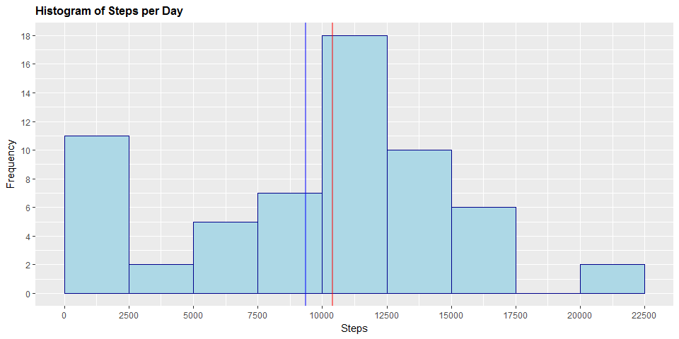
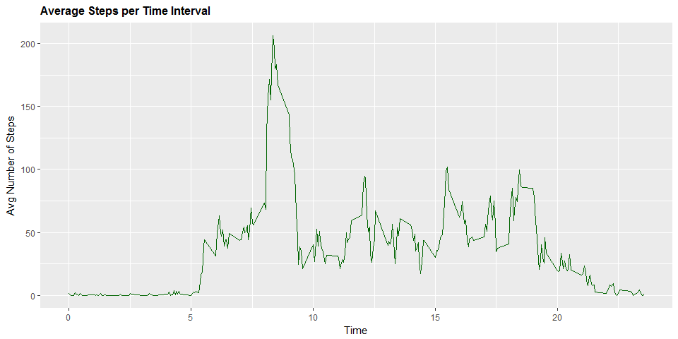
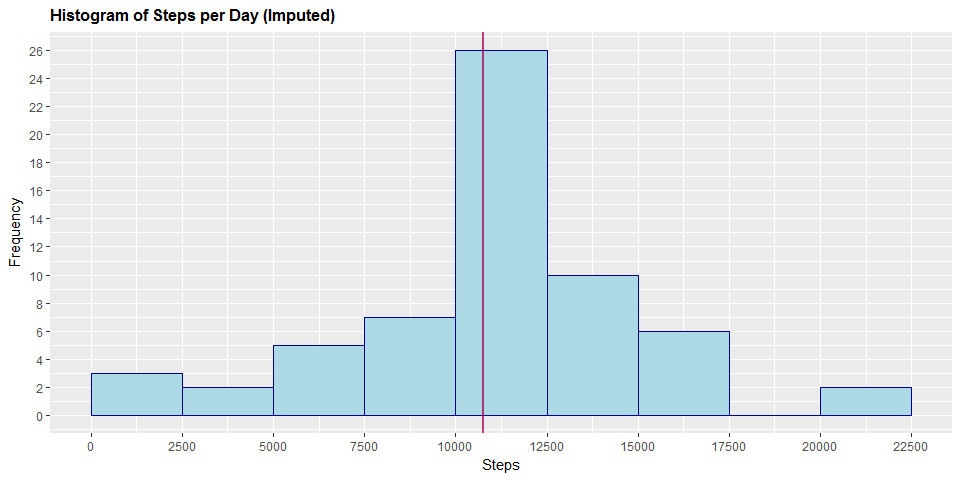
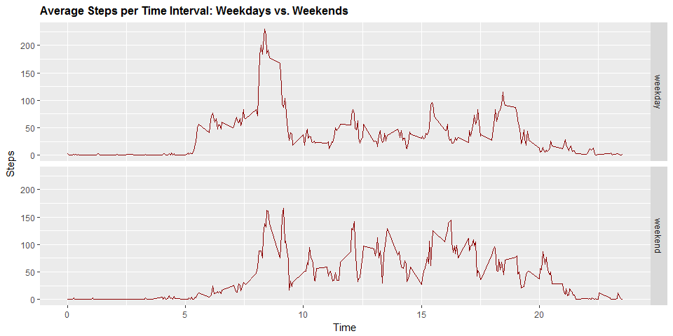

# Reproducible Research: Peer Assessment 1

This is my submission for Reproducible Research Course Project.

+ To read more information view the [ReadMe](https://github.com/dbwebhead/reproducible-research/blob/master/README.md) on GitHub.

+ The data for the assignment can be downloaded [here](https://github.com/dbwebhead/reproducible-research/blob/master/activity.zip). 

## Loading and preprocessing the data
*Show any code that is needed to:*  
*1. Load the data (i.e. read.csv())*  
*2. Process/transform the data (if necessary) into a format suitable for your analysis*  


```r
# import the activity data file
activity_df <- read.csv("activity.csv")

## Install necessary packages
if (!require("ggplot2")) {
        install.packages("ggplot2", dependencies = TRUE)
}	
if (!require("dplyr")) {
        install.packages("dplyr", dependencies = TRUE)
}

# invoke libraries
library(ggplot2)
library(dplyr)
# set weekdays in English (for graph axes)
Sys.setlocale("LC_TIME", "English")
```

```
## [1] "English_United States.1252"
```


```r
# some information about the variables
str(activity_df)
```

```
## 'data.frame':	17568 obs. of  3 variables:
##  $ steps   : int  NA NA NA NA NA NA NA NA NA NA ...
##  $ date    : Factor w/ 61 levels "2012-10-01","2012-10-02",..: 1 1 1 1 1 1 1 1 1 1 ...
##  $ interval: int  0 5 10 15 20 25 30 35 40 45 ...
```

As shown, the variables included in this data set are:  

1. **steps**: Number of steps taking in a 5-minute interval (missing values are coded as NA)  

2. **date**: The date on which the measurement was taken in YYYY-MM-DD format  

3. **interval**: Identifier for the 5-minute interval in which measurement was taken  

## What is mean total number of steps taken per day?

*For this part of the assignment, you can ignore the missing values in the dataset.*  
*1. Calculate the total number of steps taken per day*  
*2. Make a histogram of the total number of steps taken each day*  
*3. Calculate and report the mean and median total number of steps taken per day* 

**1. Number of steps per day:**


```r
# create and print number of steps per day
StepsPerDay <- aggregate(activity_df$steps, list(activity_df$date), 
                         FUN=sum, na.rm=TRUE)
colnames(StepsPerDay) <- c("Date", "Steps")
StepsPerDay
```

```
##          Date Steps
## 1  2012-10-01     0
## 2  2012-10-02   126
## 3  2012-10-03 11352
## 4  2012-10-04 12116
## 5  2012-10-05 13294
## 6  2012-10-06 15420
## 7  2012-10-07 11015
## 8  2012-10-08     0
## 9  2012-10-09 12811
## 10 2012-10-10  9900
## 11 2012-10-11 10304
## 12 2012-10-12 17382
## 13 2012-10-13 12426
## 14 2012-10-14 15098
## 15 2012-10-15 10139
## 16 2012-10-16 15084
## 17 2012-10-17 13452
## 18 2012-10-18 10056
## 19 2012-10-19 11829
## 20 2012-10-20 10395
## 21 2012-10-21  8821
## 22 2012-10-22 13460
## 23 2012-10-23  8918
## 24 2012-10-24  8355
## 25 2012-10-25  2492
## 26 2012-10-26  6778
## 27 2012-10-27 10119
## 28 2012-10-28 11458
## 29 2012-10-29  5018
## 30 2012-10-30  9819
## 31 2012-10-31 15414
## 32 2012-11-01     0
## 33 2012-11-02 10600
## 34 2012-11-03 10571
## 35 2012-11-04     0
## 36 2012-11-05 10439
## 37 2012-11-06  8334
## 38 2012-11-07 12883
## 39 2012-11-08  3219
## 40 2012-11-09     0
## 41 2012-11-10     0
## 42 2012-11-11 12608
## 43 2012-11-12 10765
## 44 2012-11-13  7336
## 45 2012-11-14     0
## 46 2012-11-15    41
## 47 2012-11-16  5441
## 48 2012-11-17 14339
## 49 2012-11-18 15110
## 50 2012-11-19  8841
## 51 2012-11-20  4472
## 52 2012-11-21 12787
## 53 2012-11-22 20427
## 54 2012-11-23 21194
## 55 2012-11-24 14478
## 56 2012-11-25 11834
## 57 2012-11-26 11162
## 58 2012-11-27 13646
## 59 2012-11-28 10183
## 60 2012-11-29  7047
## 61 2012-11-30     0
```


**2. Histogram of the total number of steps taken each day:**  

+ Below is a histogram of the aggregate number of steps taken per day.  
+ On the histogram, a blue and a red vertical line is drawn to show the mean and median value of the data, respectively.


```r
# draw the histogram
ggplot(StepsPerDay, aes(Steps)) +
	geom_histogram(boundary=0, binwidth=2500, col="darkblue", fill="lightblue") + 
	ggtitle("Histogram of Steps per Day") + 
	xlab("Steps") + 
	ylab("Frequency") + 
	theme(plot.title = element_text(face="bold", size=12)) + 
        geom_vline(xintercept=mean(StepsPerDay$Steps, na.rm=TRUE), size=1, color="blue", alpha=.5) +
        geom_vline(xintercept=median(StepsPerDay$Steps, na.rm=TRUE), size=1, color="red", alpha=.5) +
	scale_x_continuous(breaks=seq(0,25000,2500)) + 
	scale_y_continuous(breaks=seq(0,18,2))
```

<!-- -->


**3. Mean and median of total number of steps taken per day:**


```r
# calculate mean (ignoring missing values)
stepMean <- mean(StepsPerDay$Steps, na.rm=TRUE)
print(paste("The Mean number of steps per day is", round(stepMean,1)))
```

```
## [1] "The Mean number of steps per day is 9354.2"
```

```r
# calculate median (ignoring missing values)
stepMedian <- median(StepsPerDay$Steps, na.rm=TRUE)
print(paste("The Median number of steps per day is", round(stepMedian,1)))
```

```
## [1] "The Median number of steps per day is 10395"
```


## What is the average daily activity pattern?  
*1. Make a time series plot (i.e., type = "l") of the 5-minute interval (x-axis) and the average number of steps taken, averaged across all days (y-axis).  2. Which 5-minute interval, on average across all the days in the dataset, contains the maximum number of steps?* 

+ With the time series plot below, it is evident that the maximum number of steps on average across all the days appears to be a little over 200.  This occurs approximately at the 8-minute mark.  

**1. Time series plot of the 5 minute interval (x) and average number of steps taken averaged across all days (y):**


```r
# create table with steps per time
StepsPerTime <- aggregate(steps~interval, data=activity_df, FUN=mean, na.action=na.omit)

# set variable time to make the graph axis more coherent
StepsPerTime$time <- StepsPerTime$interval/100

# draw the line plot
ggplot(StepsPerTime, aes(time, steps)) + 
        geom_line(col="dark green") + 
        ggtitle("Average Steps per Time Interval") + 
        xlab("Time") + ylab("Avg Number of Steps") + 
        theme(plot.title = element_text(face="bold", size=12))
```

<!-- -->

**2. Display the 5-minute interval (on average across all the days) with the maximum number of steps**


```r
# table for dplyr
steps_df <- tbl_df(StepsPerTime)

# find the column
steps_df %>% select(time, steps) %>% filter(steps==max(steps_df$steps))
```

```
## # A tibble: 1 × 2
##    time    steps
##   <dbl>    <dbl>
## 1  8.35 206.1698
```

## Imputing missing values

+ *Note that there are a number of days/intervals where there are missing values (coded as NA). The presence of missing days may introduce bias into some calculations or summaries of the data.**  
**1. Calculate and report the total number of missing values in the dataset (i.e. the total number of rows with NAs)*  
*2. Devise a strategy for filling in all of the missing values in the dataset. The strategy does not need to be sophisticated. For example, you could use the mean/median for that day, or the mean for that 5-minute interval, etc.*  
*3. Create a new dataset that is equal to the original dataset but with the missing data filled in.*  
*4. Make a histogram of the total number of steps taken each day and Calculate and report the mean and median total number of steps taken per day.*  
+ *Do these values differ from the estimates from the first part of the assignment?*  
+ *What is the impact of imputing missing data on the estimates of the total daily number of steps?* 

**1. Determine total number of missing values in the dataset:**


```r
# table for dplyr
activity_tbl <- tbl_df(activity_df)

# display first few rows showing the missing values
head(activity_tbl)
```

```
## # A tibble: 6 × 3
##   steps       date interval
##   <int>     <fctr>    <int>
## 1    NA 2012-10-01        0
## 2    NA 2012-10-01        5
## 3    NA 2012-10-01       10
## 4    NA 2012-10-01       15
## 5    NA 2012-10-01       20
## 6    NA 2012-10-01       25
```

```r
# find the column
activity_tbl %>% 
   filter(is.na(steps)) %>% 
   summarize(missing_values = n())
```

```
## # A tibble: 1 × 1
##   missing_values
##            <int>
## 1           2304
```

**2. Replace missing values:**  

+ The rounded values of the average 5-minute interval is used to replace the 2,304 NA values.  
+ *CompleteSteps* is the new column without missing values.


```r
# values with NA are imputed in a new column
activity_df$CompleteSteps <- 
  ifelse(is.na(activity_df$steps),
  round(StepsPerTime$steps[match(activity_df$interval,StepsPerTime$interval)],0),
  activity_df$steps)
```

**3. Create a new dataset that is equal to the original dataset but with the missing data filled in:**  

+ The first ten values of the new data set are shown below. 


```r
# create new imputed dataset
activityFull_df <- data.frame(steps=activity_df$CompleteSteps, 
                              interval=activity_df$interval, date=activity_df$date)

# display the first ten rows of the new dataset
head(activityFull_df, n=10)
```

```
##    steps interval       date
## 1      2        0 2012-10-01
## 2      0        5 2012-10-01
## 3      0       10 2012-10-01
## 4      0       15 2012-10-01
## 5      0       20 2012-10-01
## 6      2       25 2012-10-01
## 7      1       30 2012-10-01
## 8      1       35 2012-10-01
## 9      0       40 2012-10-01
## 10     1       45 2012-10-01
```

**4A. Histogram of the total number of steps taken each day (with missing data filled in):** 


```r
# prepare data
StepsPerDayFull <- aggregate(activityFull_df$steps, list(activityFull_df$date), FUN=sum)
colnames(StepsPerDayFull) <- c("Date", "Steps")

# draw the histogram
ggplot(StepsPerDayFull, aes(Steps)) +
	geom_histogram(boundary=0, binwidth=2500, col="darkblue", fill="lightblue") + 
	ggtitle("Histogram of Steps per Day (Imputed)") + 
	xlab("Steps") +
	ylab("Frequency") + 
        geom_vline(xintercept=mean(StepsPerDayFull$Steps, na.rm=TRUE), size=1, color="blue", alpha=.5) +
        geom_vline(xintercept=median(StepsPerDayFull$Steps, na.rm=TRUE), size=1, color="red", alpha=.5) +
	theme(plot.title = element_text(face="bold", size=12)) +
	scale_x_continuous(breaks=seq(0,25000,2500)) + 
	scale_y_continuous(breaks=seq(0,26,2))
```

<!-- -->

**4B. Calculate and report the mean and median total number of steps taken per day:**  

+ *Do these values differ from the estimates from the first part of the assignment?*    
+ *What is the impact of imputing missing data on the estimates of the total daily number of steps?* 


```r
# calculate mean (missing values imputed)
stepMeanImp <- mean(StepsPerDayFull$Steps)
print(paste("The imputed Mean number of steps per day is", round(stepMeanImp,2)))
```

```
## [1] "The imputed Mean number of steps per day is 10765.64"
```

```r
# calculate median (missing values imputed)
stepMedianImp <- median(StepsPerDayFull$Steps)
print(paste("The imputed Median number of steps per day is", round(stepMedianImp,2)))
```

```
## [1] "The imputed Median number of steps per day is 10762"
```

+ Evidently, imputing the missing data has minimal impact on the mean and the median of the total daily number of steps.  
+ Watching the histogram we note that the only bin that has changed is the interval between 10000 and 12500 steps, which has grown from a frequency of 18 to a frequency of 26.  
+ Note the difference between the mean and median has shrunken to the point where it is hard to differentiate between the two on the histogram. 
+ Also note that different methods for replace missing values may cause different results.

## Are there differences in activity patterns between weekdays and weekends?  
+ *For this part the weekdays() function may be of some help here. Use the dataset with the filled-in missing values for this part.*  
*1. Create a new factor variable in the dataset with two levels - "weekday" and "weekend" indicating whether a given date is a weekday or weekend day.*  
*2. Make a panel plot containing a time series plot (i.e. type = "l") of the 5-minute interval (x-axis) and the average number of steps taken, averaged across all weekday days or weekend days (y-axis).* 

**1. Create a new factor variable in the dataset with two levels - "weekday" and "weekend" indicating whether a given date is a weekday or weekend day:**  

+ *DayType* is the new column indicating if the day is a weekday day or weekend day.  
+ The first ten values of the new table are shown below:


```r
# create new date variable in yyyy-mm-dd format 
activityFull_df$RealDate <- as.Date(activityFull_df$date, format = "%Y-%m-%d")

# create a weekday variable using the weekdays function
activityFull_df$weekday <- weekdays(activityFull_df$RealDate)

# create a new day type variable (indicating weekday or weekend day)
activityFull_df$DayType <- ifelse(activityFull_df$weekday=='Saturday' | 
                        activityFull_df$weekday=='Sunday', 'weekend','weekday')

# display first ten values
head(activityFull_df, n=10)
```

```
##    steps interval       date   RealDate weekday DayType
## 1      2        0 2012-10-01 2012-10-01  Monday weekday
## 2      0        5 2012-10-01 2012-10-01  Monday weekday
## 3      0       10 2012-10-01 2012-10-01  Monday weekday
## 4      0       15 2012-10-01 2012-10-01  Monday weekday
## 5      0       20 2012-10-01 2012-10-01  Monday weekday
## 6      2       25 2012-10-01 2012-10-01  Monday weekday
## 7      1       30 2012-10-01 2012-10-01  Monday weekday
## 8      1       35 2012-10-01 2012-10-01  Monday weekday
## 9      0       40 2012-10-01 2012-10-01  Monday weekday
## 10     1       45 2012-10-01 2012-10-01  Monday weekday
```

**2. Create two time series plot of the 5-minute interval (x) and the average number of steps taken averaged across weekday days or weekend days (y):** 


```r
# create table with steps per time across weekday days or weekend days
StepsPerTime_dt <- aggregate(steps~interval + DayType, data=activityFull_df, FUN=mean, na.action=na.omit)

# set variable time (for the graph axis)
StepsPerTime_dt$time <- StepsPerTime$interval/100

# draw the line plot
ggplot(StepsPerTime_dt, aes(time, steps)) +
        geom_line(col="darkgreen") +
        ggtitle("Average Steps per Time Interval: Weekdays vs. Weekends") + 
        xlab("Time")+ylab("Avg Number of Steps") + 
        theme(plot.title = element_text(face="bold", size=12)) + 
        facet_grid(DayType ~ .)
```

<!-- -->

+ The two time series panel plots above show that the peak step value is much higher during the weekdays, while the weekends exhibit more sustained activity.
